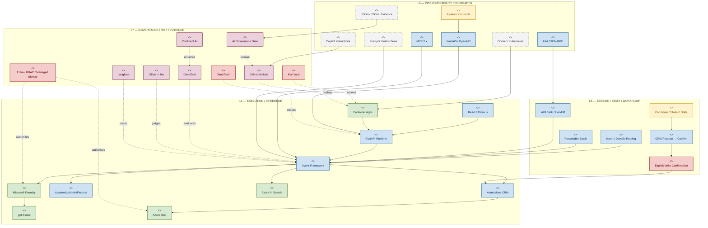
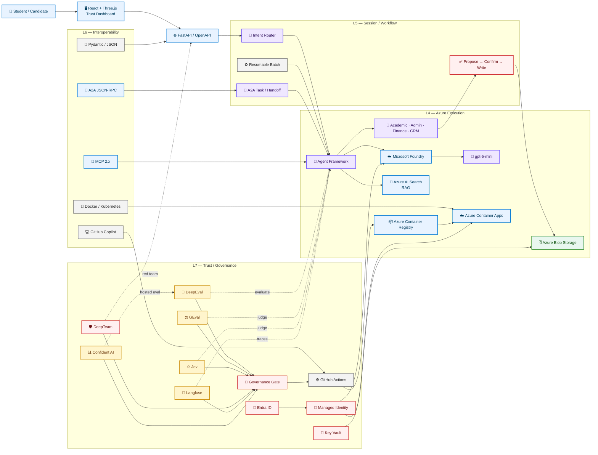

# L4–L7 architecture

## Layer definitions

- **L4 — Execution:** inference, routing, tools, RAG, persistence and runtime.
- **L5 — Session:** state, workflow, confirmation, checkpointing and agent handoff.
- **L6 — Interoperability:** APIs, contracts, MCP, A2A, prompts, containers and portability.
- **L7 — Governance:** identity, secrets, observability, evaluation, red teaming and release decisions.

## ArchiMate-style Mermaid

## Azure-style Mermaid

